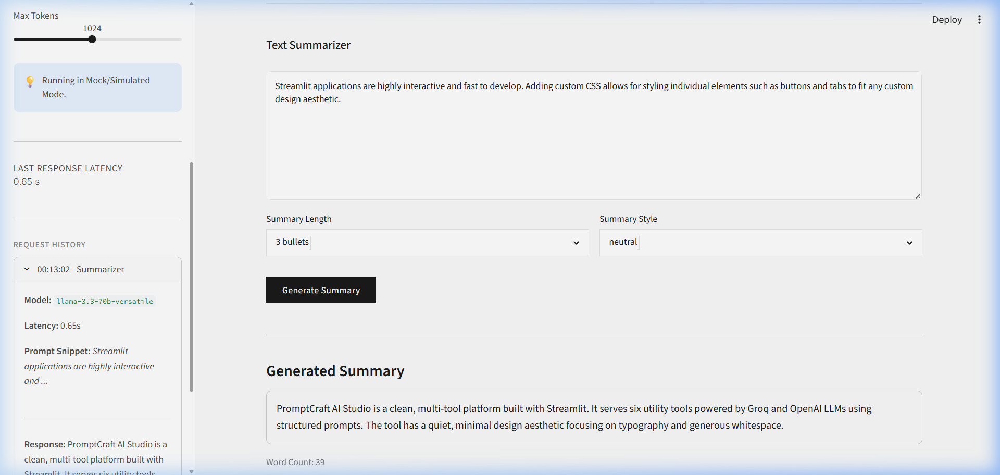
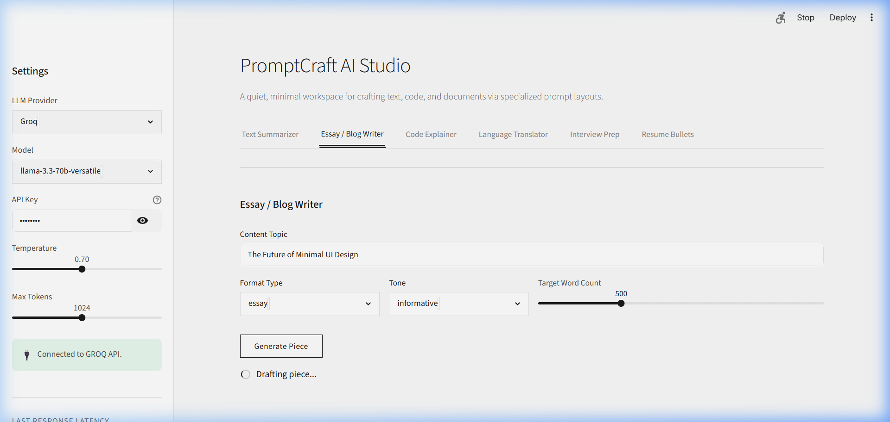
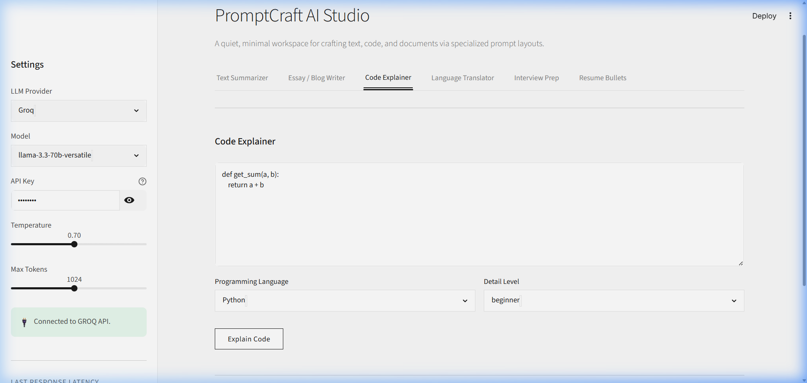
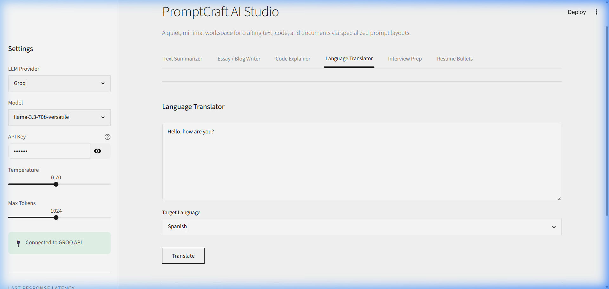
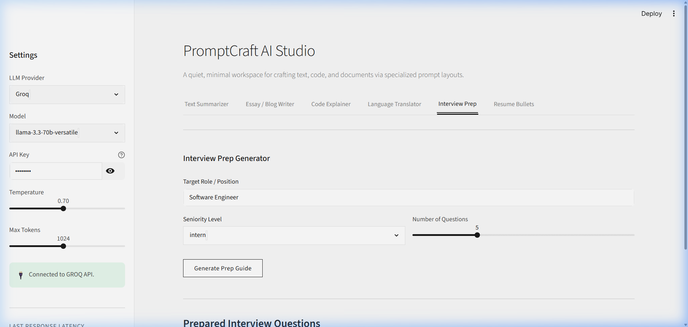
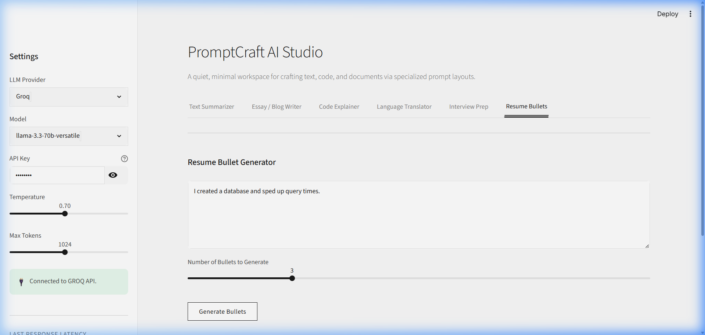
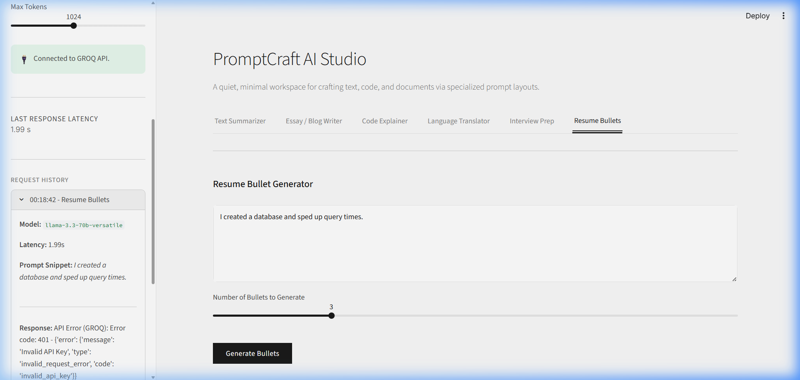

# PromptCraft AI Studio ✍️

PromptCraft AI Studio is a quiet, minimal, editorial-style multi-tool LLM wrapper designed for prompt execution. The application provides six specialized AI tools behind clean, structured prompt templates. It is built using **Streamlit** and supports both **Groq** and **OpenAI** API providers, with unified latency tracking and session-based request history.

The interface replaces traditional card shadows, saturated pill buttons, and violet gradients with a whitespace-driven, typographic-led visual system featuring hairline borders and near-white backgrounds reminiscent of Notion or Linear.

---

## Architecture & Design Decisions

### Clean Separation of Concerns
1. **`app.py`**: Handles Streamlit UI layouts, tab navigation, custom CSS injections, session state properties, latency metrics, and user input validation.
2. **`prompts.py`**: Centralizes all prompt engineering. Stores system prompts and constructor helper functions, preventing inline prompt leaking in UI code.
3. **`utils.py`**: Unified LLM dispatcher. Configures the OpenAI SDK dynamically to call either Groq endpoints (`https://api.groq.com/openai/v1`) or OpenAI endpoints. It measures request latency and includes a full-featured simulated "Mock Mode".

### Minimal Aesthetic Guidelines
- **Palette**: Near-white canvas (`#FAFAFA` background, `#FFFFFF` panels) and deep charcoal text (`#1A1A1A`).
- **Whitespace**: Prominent 3rem padding margins, generous vertical gaps, and uncluttered layouts.
- **Understated Tabs**: Streamlit tab selectors are stripped of pill backgrounds. Active tabs are demarcated by a thin bottom hairline block.
- **Buttons**: Replaced bright gradients with solid black buttons for primary submissions and light gray borders for secondary actions (like downloads).

---

## Features

| # | Tool | Input Controls | Output Format |
|---|------|----------------|---------------|
| **1** | **Text Summarizer** | Pasted source text, Summary length dropdown, Style/tone selectbox | Structured summary text block, word counter, Markdown download |
| **2** | **Essay / Blog Writer** | Topic description, Format type selector, Tone selector, Target word slider | Formatted article draft, word counter, Markdown download |
| **3** | **Code Explainer** | pasted code block, Programming language selectbox, Detail level dropdown | Markdown formatted blocks (Overview, Step-by-step, Potential Issues) |
| **4** | **Language Translator** | Text area input, Target language selector | Translated string preserving formatting, Markdown download |
| **5** | **Interview Prep Gen** | Job position role input, Seniority dropdown, Question count slider | Question list with model-answer outlines, Markdown download |
| **6** | **Resume Bullet Gen**| Plain role/task description text area, Bullet count slider | Google XYZ structured resume bullets, Markdown download |

---

## Setup & Local Execution

### Prerequisites
- Python 3.8+
- PIP (Python Package Installer)

### Installation
1. Clone the repository or navigate to the project root directory:
   ```bash
   cd CRISP_Day2_Assignment
   ```
2. Install the requirements:
   ```bash
   pip install -r requirements.txt
   ```
3. Prepare the environment file:
   - Copy `.env.example` to `.env`:
     ```bash
     cp .env.example .env
     ```
   - (Optional) Open `.env` and fill in your API credentials.

### Running the Application
Launch the Streamlit server locally:
```bash
python -m streamlit run app.py
```
The application will start and listen at `http://localhost:8501`.

*Note:* If you do not have live Groq or OpenAI API keys, you can type **`mock`** in the **API Key** input box in the sidebar to activate the simulated model response mode for local testing.

---

## Screenshots Gallery

Below are visual captures demonstrating the minimal design and response layouts of the 6 tools and sidebar history:

### 1. Text Summarizer


### 2. Essay / Blog Writer


### 3. Code Explainer


### 4. Language Translator


### 5. Interview Prep Generator


### 6. Resume Bullet Generator


### 7. Settings & Query History (Sidebar)

