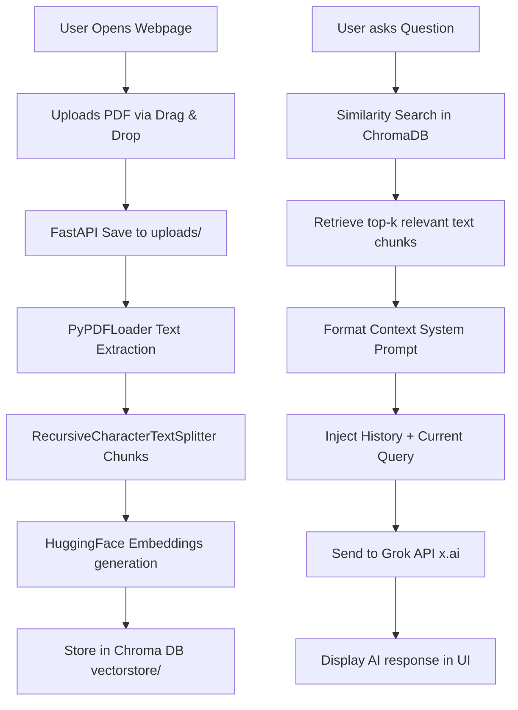

# Antigravity PDF RAG Chatbot

An elegant, production-ready, fully responsive Retrieval-Augmented Generation (RAG) PDF Question Answering Chatbot. The backend is built entirely with **FastAPI** and **LangChain**, utilizing local **HuggingFace Embeddings** (`sentence-transformers/all-MiniLM-L6-v2`) and **ChromaDB** for vector indexing. The frontend is built using a modern, dark-themed, glassmorphic layout using vanilla **HTML5**, **CSS3**, and **JavaScript**.

---

## Table of Contents
- [Project Overview](#project-overview)
- [Architecture Diagram](#architecture-diagram)
- [Key Features](#key-features)
- [Folder Structure](#folder-structure)
- [System Requirements](#system-requirements)
- [Installation Guide](#installation-guide)
- [API Setup & Environment Variables](#api-setup--environment-variables)
- [Running the Application](#running-the-application)
- [API Documentation](#api-documentation)
- [Screenshots Placeholder](#screenshots-placeholder)
- [Future Improvements](#future-improvements)
- [License](#license)

---

## Project Overview
This application allows users to upload any PDF document, automatically extracts and chunks the text, creates embeddings using an open-source model, and stores the vectors in a persistent Chroma vector database. Users can then query the document in an interactive chat interface. 

The chatbot enforces a **Strict QA Policy**: it only answers questions using the context provided in the PDF. If the answer cannot be found, it replies with:
*"I couldn't find that information in the uploaded PDF."*

This completely prevents LLM hallucinations.

---

## Architecture Diagram



---

## Key Features
- **Modern UI/UX**: Premium dark theme with glassmorphic cards, gradient glows, custom animations, and responsive layout.
- **Drag & Drop Upload**: Smooth file drop zones with file format validation.
- **True Upload Progress**: Implements browser XHR upload listeners to show exact upload progress percentage in a stylized progress bar.
- **Persistent Chroma Storage**: Embeddings are persisted in a vector store directory. The backend automatically manages creation, reuse, and garbage-collects previous databases when a new PDF is uploaded.
- **Conversation Memory**: Keeps track of prior user and assistant exchanges to handle context-aware follow-up queries.
- **Custom Markdown Rendering**: Rich formatting of lists (bullet points), code snippets, bold formatting, and paragraphs directly in the chat.
- **App Reset & Clear Chat**: Quick controls to clear active chat sessions or wipe the remote database and cache.

---

## Folder Structure
```text
pdf-chatbot/
├── backend/
│   ├── app/
│   │   ├── api/
│   │   │   ├── __init__.py
│   │   │   ├── upload.py
│   │   │   └── chat.py
│   │   ├── core/
│   │   │   ├── __init__.py
│   │   │   └── config.py
│   │   ├── services/
│   │   │   ├── __init__.py
│   │   │   ├── pdf_loader.py
│   │   │   ├── embedding_service.py
│   │   │   ├── chroma_service.py
│   │   │   ├── rag_service.py
│   │   │   └── llm_service.py
│   │   ├── __init__.py
│   │   └── main.py
│   ├── uploads/          # Saved PDF files
│   ├── vectorstore/      # Persistent SQLite/Chroma db files
│   └── requirements.txt  # Python requirements
├── frontend/
│   ├── index.html        # Main app UI structure
│   ├── style.css         # Styling system
│   └── script.js         # Frontend controller and API client
├── .env                  # Configuration variables
├── .gitignore            # Version control exclusions
└── README.md             # Project documentation
```

---

## System Requirements
- Python 3.11 or newer installed.
- Internet connection (first-time boot pulls the HuggingFace embedding model cache, ~90MB).
- A valid Grok API Key (compatible with any OpenAI API SDK endpoints).

---

## Installation Guide
Clone or copy the files into a clean workspace, then open your terminal.

1. **Set up a Virtual Environment (Optional but Recommended):**
   ```bash
   python -m venv venv
   # On Windows:
   venv\Scripts\activate
   # On macOS/Linux:
   source venv/bin/activate
   ```

2. **Install Dependencies:**
   Navigate to the `backend/` directory and install:
   ```bash
   cd backend
   pip install -r requirements.txt
   ```

---

## API Setup & Environment Variables
Copy or create a `.env` file at the root of the workspace directory.

Modify the configuration variables inside `.env`:
```env
# Grok API Credentials
GROK_API_KEY=xai-your-api-key-here
GROK_BASE_URL=https://api.x.ai/v1
MODEL_NAME=grok-2-1212
```

---

## Running the Application
From the `backend/` directory, start the Uvicorn dev server:
```bash
uvicorn app.main:app --reload
```
Once the server starts:
- The FastAPI backend API will be available at `http://127.0.0.1:8000/`.
- The user interface is served directly from the server. Open **`http://127.0.0.1:8000/`** in your browser.

---

## API Documentation

| Method | Endpoint | Description |
| :--- | :--- | :--- |
| `POST` | `/upload` | Uploads a PDF file, splits text, computes embeddings, and stores in database. |
| `POST` | `/chat` | Submits a query along with previous conversation history to retrieve context and output answers. |
| `DELETE` | `/clear` | Wipes the vector database folder and uploaded references. |
| `GET` | `/health` | Retrieves status metrics of the system. |

---

## Screenshots Placeholder
Once deployed, append images here:
``

---

## Future Improvements
- **OCR Integration**: Parse scanned image-only PDFs using `pytesseract` or similar layout models.
- **Chunk Visualization**: Show matching source snippets and matching page numbers inside the chat UI (citation source tags).
- **Multi-File Context**: Allow indexing multiple files simultaneously.

---

## License
MIT License. Created by Antigravity.
