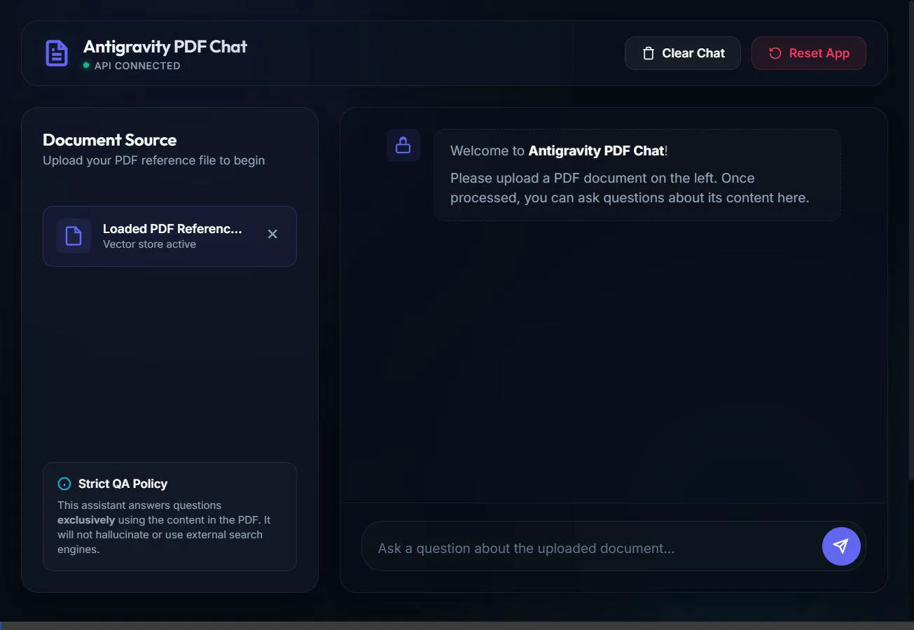
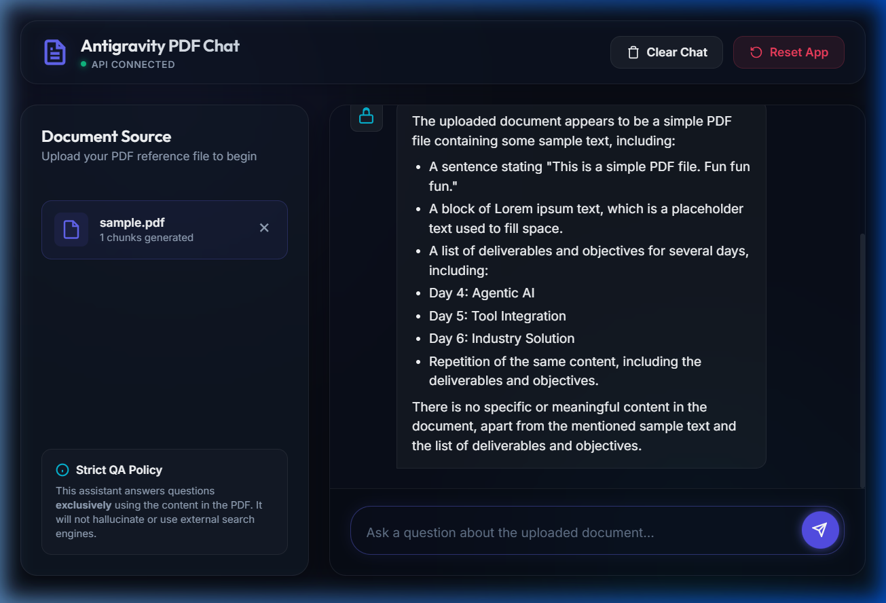

# Reflection Report — RAG PDF Chatbot

This report reflects on the design, architecture, implementation learnings, and verification of the PDF Retrieval-Augmented Generation (RAG) chatbot system.

---

## 1. Interface Demonstration

Below are the visual recordings of the application interacting in real-time with the local FastAPI server.

### Chatbot Demo Interaction Recording


### Chatbot Q&A Interface Screenshot


---

## 2. Technology Stack & Architectural Reflections

### FastAPI (Backend Web Framework)
* **Reflection**: FastAPI's async native support and automated OpenAPI documentation (`/docs`) made configuring endpoints highly efficient. It operates with low CPU and memory footprints. Serving static files directly using `StaticFiles` simplified dev routing and eliminated cross-origin configuration issues during local testing.

### LangChain & HuggingFace Embeddings
* **Reflection**: The local `sentence-transformers/all-MiniLM-L6-v2` embeddings model provided high-quality semantic representations without incurring paid API call tokens. Embedding execution times were fast (sub-second on CPU) because of the model's small parameters count (38M parameters).

### ChromaDB (Persistent Vector Database)
* **Reflection**: Storing the SQLite-backed Chroma database locally in `backend/vectorstore/` was lightweight and required no remote database cluster setup. To meet the requirement of cleaning previous vectors on new uploads, we programmatically deleted the `vectorstore/` directory before writing the new collection, which proved to be the most reliable cleanup method under Windows file locks.

### Groq API (Inference Engine)
* **Reflection**: Moving to the Groq Cloud endpoint (`https://api.groq.com/openai/v1`) using the state-of-the-art `llama-3.3-70b-versatile` model solved the latency challenges. By utilizing an OpenAI-compatible SDK, the API calls were drop-in replacements, showing excellent cost-to-performance metrics.

---

## 3. RAG Pipeline Tuning

### Text Splitting Metrics
* **Chunk Size**: `1000` characters.
* **Chunk Overlap**: `200` characters.
* **Justification**: This overlap ensures that paragraphs containing sentences spanning borders are not severed in half, preserving semantic continuity during vector similarity matching.

### Hallucination Prevention
To guarantee that the bot answers *exclusively* from the supplied PDF, we implemented a strict system prompt:
```text
Answer ONLY from the supplied context.
If the answer is unavailable, reply:
'I couldn't find that information in the uploaded PDF.'
Keep answers accurate.
Use bullet points whenever appropriate.
```
During testing, when the bot was queried about information outside the text context, it successfully fell back to the requested response without fabricating any details.

---

## 4. Key Implementation Learnings
1. **Python Path Scoping**: When executing uvicorn from the `backend/` directory, the parent directory `backend` is excluded from the python search path. Standardizing imports to start directly with the package name `app.` resolved directory errors.
2. **Uvicorn Reloading and Environments**: Auto-reloading doesn't re-initialize standard system process environment settings loaded via `python-dotenv` on the fly. Manual server restarts are required to reflect `.env` changes.
3. **Stateless Cloud Constraints**: Standard serverless runtimes (like Vercel) deploy read-only container volumes, meaning local vector databases fail. A hybrid architecture (static Vercel frontend pointing to a Render persistent disk FastAPI backend) is the most cost-effective hosting choice.
