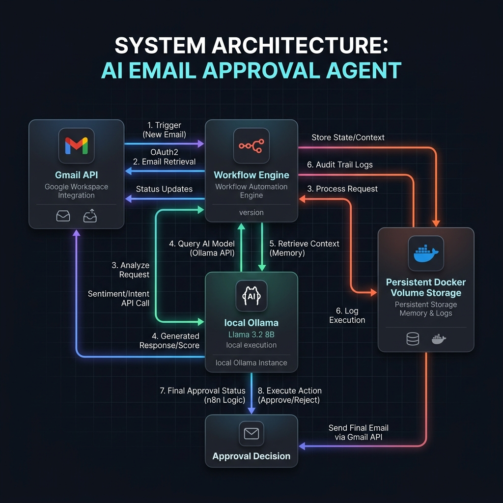
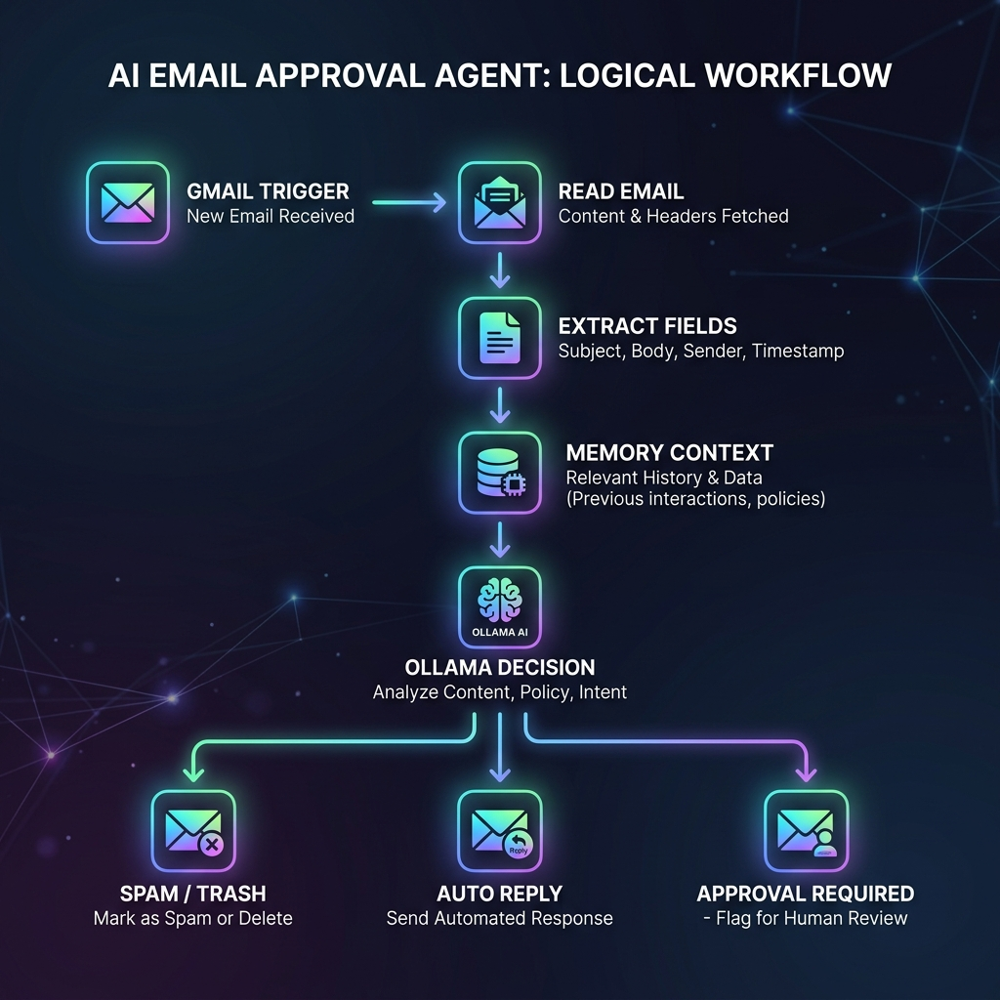

# 🤖 AI Email Approval Agent

AI Email Approval Agent is a production-ready, local, and completely autonomous email assistant. Built using **n8n**, **Docker**, **Gmail API**, and **Ollama (Llama 3.2)**, it monitors your inbox, understands incoming emails, maintains past conversation memory, classifies spam, auto-replies to simple queries, and emails you for approval on complex threads with easy Approve/Reject click actions.

---

## 🎨 System Architecture Diagram



---

## 🔄 Workflow Logic



---

## ✨ Features

* **Real-time Gmail Monitoring**: Listens to unread incoming emails and processes them sequentially.
* **Autonomous Decision Engine**: Powered by Ollama (`llama3.2`) to intelligently classify emails.
* **File-based Conversation Memory**: Stores complete sender context in a lightweight `/data/memory/<email>.json` file.
* **Structured Markdown Logs**: Auto-generates audit reports inside `/logs/` partitioned by category (Spam/Rejection/Auto-reply).
* **Human-in-the-Loop Webhook Gate**: Pauses workflow and sends an approval request email to the admin. Clicking **Approve** or **Reject** triggers immediate automated routing.
* **Built-in Error Handling & Fallbacks**: Fallback states activate automatically on parse failures or engine timeouts to prevent loop failure.

### 🌟 Bonus Features
* **Confidence & Urgency Scoring**: Prioritizes urgent items based on AI classification.
* **Sentiment Analysis**: Tracks customer mood (positive, neutral, negative).
* **Automated Summaries**: Condenses long threads into single-sentence summaries.
* **Follow-up Action Suggestions**: Proposes next steps for the operator.

---

## 📁 Project Structure

```
email-agent/
├── docker-compose.yml       # Orchestrates n8n and Ollama
├── README.md                # Project documentation
├── .env                     # Local environment settings
├── .env.example             # Template for variables
│
├── workflows/
│   └── email_agent.json     # Complete 25-node n8n workflow
│
├── data/
│   └── memory/              # Lightweight JSON sender memory files
│
├── logs/                    # Generated Markdown reports at runtime
│   ├── spam/                # Spam log folder
│   └── rejected/            # Rejections log folder
│
├── docs/
│   ├── setup.md             # In-depth setup & troubleshooting guide
│   ├── architecture.png     # System architecture diagram
│   └── workflow.png         # Flowchart diagram
│
└── screenshots/
    ├── 01-dashboard.png     # n8n editor canvas running
    ├── 02-gmail-trigger.png  # Gmail Trigger configuration
    ├── 03-ai-planner.png    # Ollama node payload view
    ├── 04-approval-email.png # Sample approval notification layout
    └── 05-success.png       # Success logs explorer status
```

---

## ⚙️ Environment Variables (`.env`)

Create a `.env` file using `.env.example` as a template:

```ini
N8N_PORT=5679
N8N_USER=admin
N8N_PASSWORD=admin123

GMAIL_CLIENT_ID=your_client_id.apps.googleusercontent.com
GMAIL_CLIENT_SECRET=your_client_secret
GMAIL_REFRESH_TOKEN=your_refresh_token
GMAIL_USER_EMAIL=your_email@gmail.com
ADMIN_EMAIL=your_email@gmail.com

OLLAMA_MODEL=llama3.2
OLLAMA_PORT=11435
TZ=Asia/Kolkata
```

---

## 🚀 Quick Start

### 1. Build and Run
Start the entire local infrastructure:
```bash
docker compose up -d
```

### 2. Monitor Initial Download
The init container pulls `llama3.2` model on first boot. Check progress with:
```bash
docker logs -f ollama_agent_init
```

### 3. n8n Access
* **URL**: `http://localhost:5679`
* **Credentials**: `admin` / `admin123`

---

## 🖼️ UI Screenshots Gallery

### 01. n8n Workflow Editor Canvas


### 02. Gmail Trigger Node


### 03. Ollama Node & Payload


### 04. Approval Email Request Layout


### 05. Success Logs File System


---

## 🔮 Future Improvements

1. **Vector Embedding Search**: Transition local storage from JSON files to a vector database for semantic chunked memory retrieval.
2. **Multi-Model Routing**: Direct low-priority emails to small, fast models and complex inquiries to heavy reasoning models.
3. **Advanced Web Dashboard**: A lightweight Next.js interface displaying incoming inbox stats, confidence histories, and sentiment dynamics.
