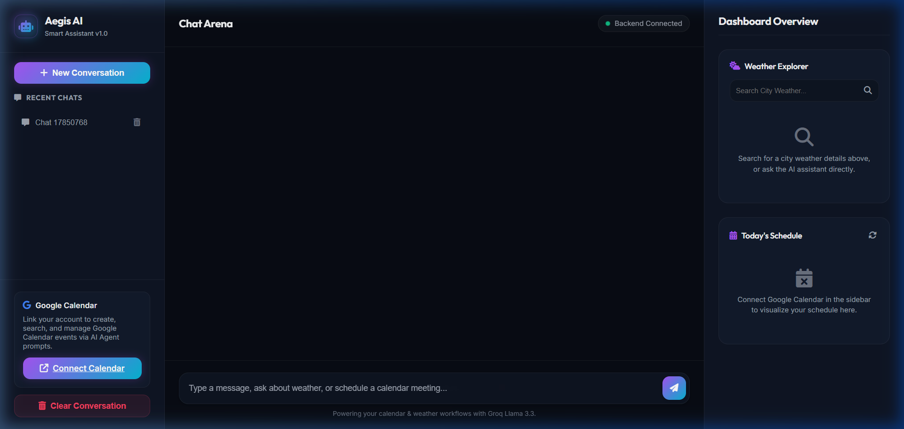
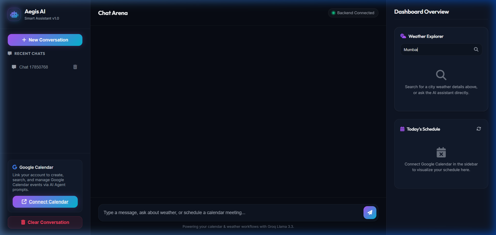
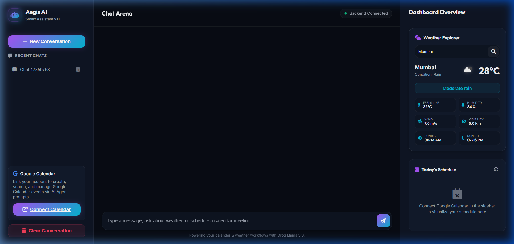
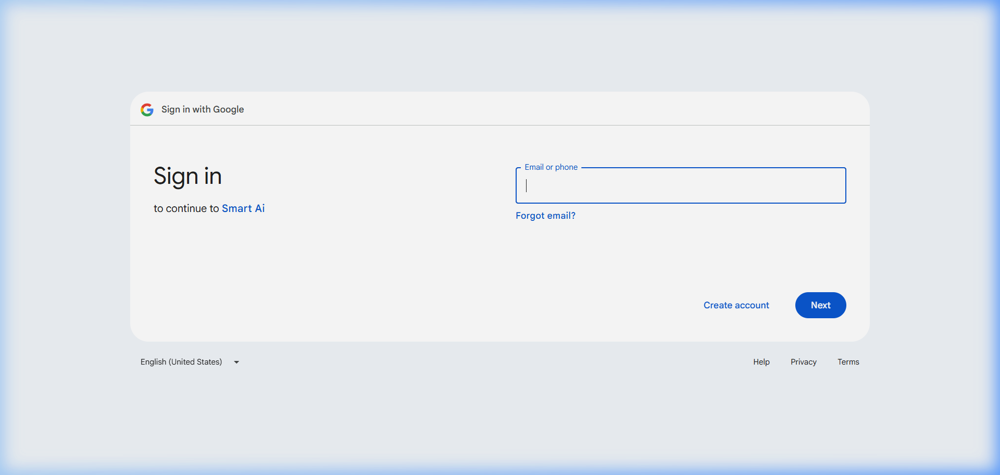
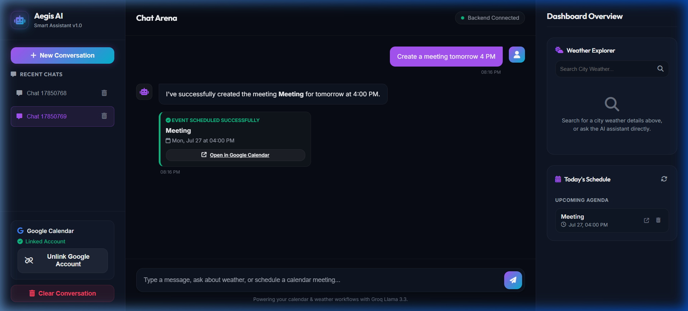
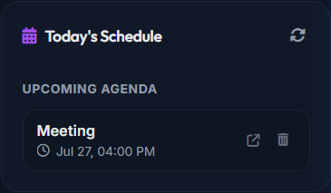
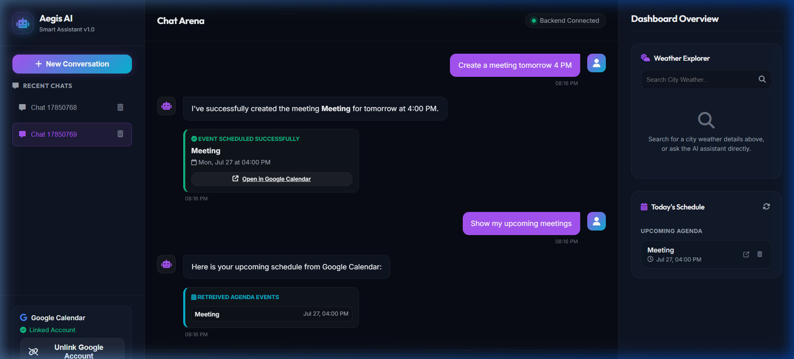
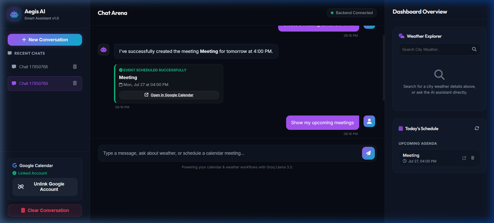
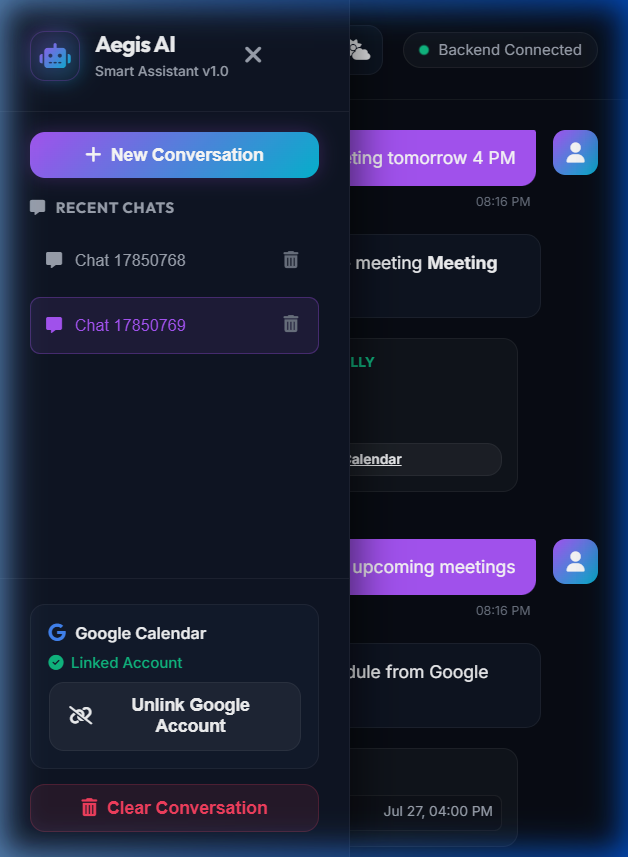
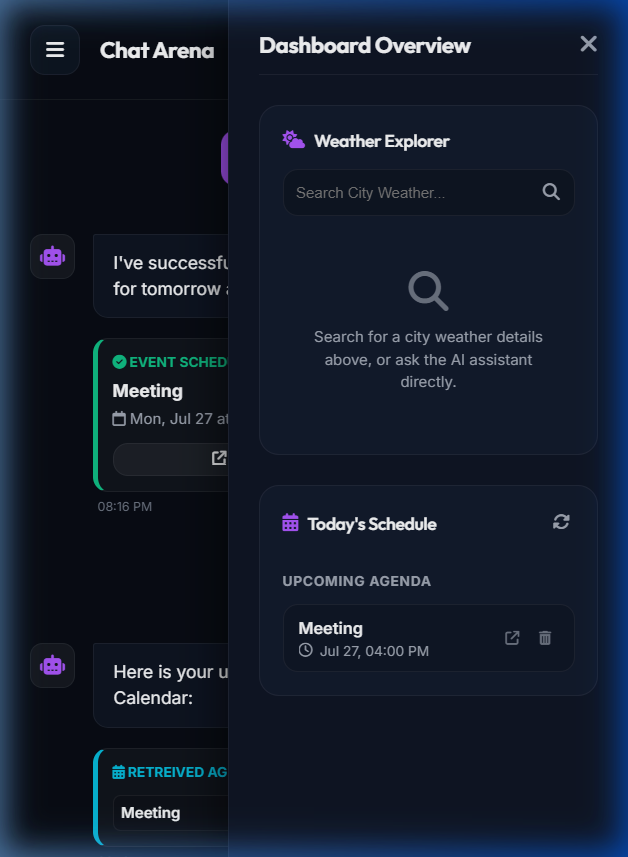

# Aegis AI: Smart Personal Assistant - Tool Integration

Welcome to **Aegis AI**, a complete, production-ready, fully functional AI Smart Personal Assistant built for the **CRISP GenAI & Agentic AI Day 5 Assignment**. 

Aegis is an intelligent agent capable of understanding natural language requests, determining user intent, automatically routing tasks to weather or calendar APIs, executing those tools, and synthesizing responses into natural, friendly conversational outputs.

---

## 🌟 Features

- **Agentic Intent Detection**: Uses Groq Llama 3.3 (or Gemini 1.5 Flash) to parse user query intents and extract precise parameters (like city names and ISO timestamps).
- **Weather Integration**: Fetches real-time weather details (current temp, feels like, humidity, pressure, wind, clouds) from the OpenWeatherMap API and renders gorgeous visual weather cards.
- **Google Calendar Coordination**: Full CRUD scheduling integration (create, list, update, delete, search) using OAuth 2.0. Resolves human terms like "tomorrow at 5 PM" to concrete dates relative to the active host clock.
- **Conversational Memory**: Chat logs are saved to an SQLite database (`ChatHistory`) and loaded into the LLM context to maintain continuous dialogue tracking.
- **Robust Credentials Management**: Auto-refresh mechanisms for Google Calendar tokens, stored securely within the SQLite database.
- **Premium Glassmorphic UI**: Translucent cards, neon borders, smooth micro-animations, loading spinners, toast notifications, chat template shortcuts, and full mobile-responsive sidebar drawers.
- **Three-tier Fallback Protection**: Auto-detects available API keys. Falls back from Groq -> Gemini -> local keyword-based router, preventing application crashes.

---

## 🏗️ Architecture

```
                 +-----------------------+
                 |    User Chat Input    |
                 +-----------+-----------+
                             |
                             v
                 +-----------+-----------+
                 |    FastAPI Backend    |<-------> SQLite Database
                 +-----------+-----------+      (History & Tokens)
                             |
                             v
                 +-----------+-----------+
                 |      AI Agent         |
                 | (Intent Classifier)   |
                 +-----------+-----------+
                             |
            +----------------+----------------+
            | (Weather)      | (Calendar)     | (General)
            v                v                v
      +-----+------+   +-----+------+   +-----+------+
      | Weather    |   | Google     |   | General    |
      | Explorer   |   | Calendar   |   | Memory     |
      | (Tool)     |   | (Tool)     |   | Chat       |
      +-----+------+   +-----+------+   +-----+------+
            |                |                |
            v                v                |
      OpenWeatherMap   Google APIs            |
           API          (OAuth 2)             |
            |                |                |
            +----------------+----------------+
                             |
                             v
                 +-----------+-----------+
                 |  LLM Synthesizer      |
                 | (Groq / Gemini)       |
                 +-----------+-----------+
                             |
                             v
                 +-----------+-----------+
                 | Friendly Chat Bubble  |
                 | & Interactive Widget  |
                 +-----------------------+
```

---

## 📁 Folder Structure

```
A-Tool-Integration/
├── backend/
│   ├── app.py              # Application entrypoint & Static hosting
│   ├── routes.py           # API endpoint handlers & OAuth callback
│   ├── agent.py            # Agentic orchestration & context synthesis
│   ├── weather.py          # Weather API integration wrapper
│   ├── calendar_tool.py    # Google Calendar API CRUD tool
│   ├── llm.py              # Groq/Gemini client wrappers & structured parsing
│   ├── database.py         # SQLAlchemy DB engine & Session setup
│   ├── config.py           # Dotenv parser & config settings
│   ├── models.py           # SQLAlchemy SQLite schema models
│   ├── schemas.py          # Pydantic validation schemas
│   ├── auth.py             # Google Calendar OAuth 2.0 flow helper
│   └── utils.py            # Time formatting & logger configurations
├── frontend/
│   ├── index.html          # Core dashboard layout
│   ├── style.css           # Glassmorphism styling sheets
│   └── script.js           # AJAX fetch methods & UI logic
├── screenshots/
│   └── README.md           # Instructions for capturing required screenshots
├── .env.example            # Environment configurations blueprint
├── .gitignore              # Git file exclusions
├── requirements.txt        # Backend dependencies manifest
├── LICENSE                 # MIT License file
├── reflection_report.md    # CRISP Reflection report
└── demo_video_script.md    # 5-minute video narration guide
```

---

## 🚀 Installation & Setup

### Prerequisites
- Python 3.11 or higher
- Google Cloud Console access (for Google Calendar OAuth credentials)
- OpenWeatherMap Account (for Weather API Key)
- Groq Console or Google AI Studio (for LLM API Keys)

### Step 1: Clone and Prepare Workspace
Copy all project files into your local directory.

### Step 2: Set Up Virtual Environment
Create and activate a Python virtual environment:
```bash
# Windows
python -m venv venv
venv\Scripts\activate

# macOS / Linux
python3 -m venv venv
source venv/bin/activate
```

### Step 3: Install Dependencies
```bash
pip install -r requirements.txt
```

### Step 4: Configure Environment Variables
1. Copy the `.env.example` file to create your active `.env` file:
   ```bash
   copy .env.example .env
   ```
2. Open `.env` and fill in your API credentials (see API Setup sections below).

---

## 🔌 API Credentials Configuration

### 1. Groq LLM Setup (Preferred)
1. Go to the [Groq Console](https://console.groq.com/).
2. Create an API Key and copy it.
3. Paste it in your `.env`:
   ```env
   GROQ_API_KEY=gsk_...
   LLM_PROVIDER=groq
   ```
*(If you want to use Google Gemini instead, configure `GEMINI_API_KEY=AIzaSy...` and set `LLM_PROVIDER=gemini`)*

### 2. Weather API Setup
1. Sign up for a free account at [OpenWeatherMap](https://openweathermap.org/).
2. Navigate to the API Keys tab, generate a key, and copy it.
3. Paste it in your `.env`:
   ```env
   OPENWEATHER_API_KEY=your_openweathermap_api_key
   ```

### 3. Google Calendar API & OAuth 2.0 Setup
1. Go to the [Google Cloud Console](https://console.cloud.google.com/).
2. Create a new project (e.g. "Aegis AI Assistant").
3. In the sidebar, navigate to **APIs & Services > Library**. Search for **Google Calendar API** and enable it.
4. Go to the **OAuth consent screen** tab:
   - Choose **External** user type.
   - Fill in the App Name, User Support Email, and Developer Contact Email. Click Save.
   - Under **Scopes**, add `.../auth/calendar` (Google Calendar API read, edit, delete scopes).
   - Under **Test users**, add your own Google email address (crucial for testing dev status).
5. Navigate to **Credentials > Create Credentials > OAuth client ID**:
   - Application type: **Web application**.
   - Authorized redirect URIs: Add `http://localhost:8000/api/auth/callback`.
   - Click Create and copy your **Client ID** and **Client Secret**.
6. Paste these in your `.env`:
   ```env
   GOOGLE_CLIENT_ID=your_client_id.apps.googleusercontent.com
   GOOGLE_CLIENT_SECRET=your_client_secret
   GOOGLE_REDIRECT_URI=http://localhost:8000/api/auth/callback
   ```

---

## 🏃 How to Run the Application

Start the FastAPI server:
```bash
uvicorn backend.app:app --reload
```

The application will start up, automatically initialize the SQLite database `assistant.db`, create tables, and mount static files. 
- Open your browser and navigate to: **`http://localhost:8000/`**
- In the Web UI sidebar, click the **Connect Calendar** button to link Google Calendar.
- Start chatting!

---

## 💬 Example Queries to Try

- **Weather Inquiry**:
  - *"What's the weather in Mumbai?"*
  - *"Will it rain in Delhi tomorrow?"*
  - *"Can I go for a picnic in Tokyo today?"*
- **Schedule Creation**:
  - *"Create a meeting tomorrow at 4 PM named Project Review"*
  - *"Doctor appointment Friday 6 PM"*
  - *"Schedule gym session next Monday at 7 AM"*
- **Retrieve Schedule**:
  - *"Show my upcoming meetings"*
  - *"Check today's calendar"*
- **reschedule/Cancel Event**:
  - *"Cancel my dentist appointment"*
  - *"Move project review meeting to tomorrow at 6 PM"*

---

## 🎨 Screenshots Showcase

Explore Aegis AI's user interface and agent capabilities:

### 🖥️ Desktop Dashboard & Conversational Flow

| 1. Home Page Dashboard | 2. Weather Search |
| :---: | :---: |
|  |  |

| 3. Weather Results Card | 4. Google Calendar OAuth |
| :---: | :---: |
|  |  |

| 5. Calendar Event Created | 6. Today's Agenda List |
| :---: | :---: |
|  |  |

| 7. Upcoming Calendar Schedule | 8. Conversational AI Chat Flow |
| :---: | :---: |
|  |  |

### 📱 Mobile Responsive Interface

| 9. Mobile Sidebar Drawer | 10. Mobile Widgets Drawer |
| :---: | :---: |
|  |  |

For detailed instructions on capturing manually-uploaded screenshots (like FastAPI logs or VS Code folder structures), please review the [Screenshots Guide](screenshots/README.md). Place any additional captured PNGs inside the `screenshots/` directory.

---

## 📄 License

This project is licensed under the MIT License - see the [LICENSE](LICENSE) file for details.
