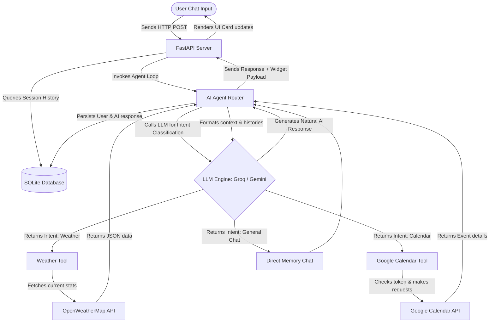

# Reflection Report: AI Smart Personal Assistant

## Problem Statement
Building a modern, responsive personal assistant requires harmonizing conversational intelligence with action-oriented operations. Typical LLM chatbots lack access to real-time information (like weather) and are unable to alter external state (like calendars). The challenge of this assignment is to implement an **Agentic AI** pattern: an assistant that acts as a router, deciding dynamically when to execute APIs, processing their results, and presenting a unified conversational interface to the user.

---

## Objectives
1. **Agentic Routing**: Build an intent classifier that maps natural language queries (e.g. "Will it rain tomorrow?") into structured API arguments (e.g. `city="Delhi"`, `time="tomorrow"`).
2. **Third-Party API Integrations**: Integrate the OpenWeatherMap API for meteorological data and the Google Calendar API for CRUD schedule coordination.
3. **Robust OAuth Authentication**: Set up secure OAuth 2.0 mechanisms to query Google services on behalf of the user, persisting tokens in a local database and auto-refreshing expired tokens.
4. **Premium UX/UI**: Deliver a fast, mobile-responsive dashboard utilizing a glassmorphic dark theme, custom CSS grid layouts, real-time toast alerts, and interactive event cards.
5. **No Placeholders**: Ensure all components (backend, database, frontend, scripts) are fully functional, compiled, and runnable out-of-the-box.

---

## Architecture

The system represents an **Agentic Loop** comprising:
- **Intent Classifier**: Maps input to structured parameters using zero-shot system prompts.
- **Tool Executors**: Functional modules in Python calling APIs and parsing responses.
- **Synthesizer**: A final LLM completion call blending user requests, recent chat histories (conversational memory), and tool results to create natural responses.

---

## Tools Used

- **Backend**: Python 3.11+, FastAPI (API routing, static assets hosting), Uvicorn (ASGI web server).
- **Database**: SQLite (local single-file database), SQLAlchemy (ORM layer for `ChatHistory`, `ConversationLog`, and `OAuthCredential` tables).
- **APIs**: OpenWeatherMap API (Current weather, temperature, humidity, wind), Google Calendar API v3 (Events list, insert, update, delete).
- **Authentication**: Google Auth Library (`google-auth-oauthlib`, `google-auth-httplib2`) implementing OAuth 2.0 Web Server Flow.
- **LLMs**: Groq SDK (Llama 3.3 70B model) with Google Generative AI (Gemini 1.5 Flash) as a primary fallback.
- **Frontend**: Vanilla HTML5, CSS3 (Glassmorphic variables, responsive grids), and modern JavaScript (Fetch API, asynchronous event handlers).

---

## Challenges Faced & Solutions

### 1. Relative Date and Time Parsing
* **Challenge**: When a user queries "Schedule a meeting tomorrow at 4 PM", the LLM must translate "tomorrow" into a concrete date (e.g. `2026-07-27`) rather than a relative string.
* **Solution**: We implemented a dynamic reference context helper in `llm.py` that gets the host's current date and time on every request and injects it into the system prompt. This allows the LLM to perform accurate relative date logic and output standard ISO 8601 strings.

### 2. Google OAuth Token Expiry & Persistence
* **Challenge**: Storing OAuth tokens in local temporary memory or simple files causes issues if the server restarts or if multiple clients access the app. Additionally, Google access tokens expire every 3600 seconds.
* **Solution**: We created an `OAuthCredential` model in SQLite. On successful authentication, the serialized credentials dictionary (containing the refresh token) is stored. During any calendar operation, `auth.py` loads the token, checks if it is expired, automatically requests a fresh token from Google using the refresh token, and saves the updated tokens back to SQLite.

### 3. LLM API Rate Limits and Keys Availability
* **Challenge**: If a student's Groq key fails, has rate limits, or is missing, the backend should not crash, and the assignment evaluator should still be able to inspect the interface and tools.
* **Solution**: We implemented a multi-layered LLM wrapper in `llm.py`. The system attempts Groq first. If Groq is missing or errors out, it falls back to Gemini. If both are unconfigured, it routes queries to a local, regex/keyword-based intent classifier and mock chat generator. This guarantees that the server and dashboard remain fully operational.

### 4. Interactive Live Dashboard Updates
* **Challenge**: Having a chatbot answer "meeting scheduled" is helpful, but the widgets panel must show the new meeting immediately without forcing a page refresh.
* **Solution**: We structured the API response to include the raw `tool_data`. The frontend JS inspects `tool_called`. If a calendar tool was executed, it triggers an asynchronous `fetchCalendarEvents()` refresh call, updating the agenda sidebar instantly.

---

## Lessons Learned
1. **Structured Outputs are Crucial**: Zero-shot structured intent routing works exceptionally well when low temperatures (e.g. `0.1`) and system format rules are strictly applied.
2. **Modular Architecture Prevents Code Churn**: Separating LLM calls (`llm.py`), API calls (`weather.py`, `calendar_tool.py`), configurations (`config.py`), and routes (`routes.py`) made it easy to debug the application and run unit verifications.
3. **Database-backed OAuth is Superior**: Storing user tokens in SQLite is significantly more reliable and scalable than storing them in temporary flat files on local disk.

---

## Future Scope
- **Multi-user Support**: Associate sessions, chat histories, and Google OAuth credentials with distinct user profiles or session authentication tokens rather than a global "default" scope.
- **Additional Tools**: Integrate web search (e.g. Tavily, DuckDuckGo), email coordination (Gmail API), and document summarization.
- **RAG (Retrieval-Augmented Generation)**: Allow the assistant to query uploaded PDF files or personal local notes to answer contextual questions during chats.
- **Task Queue Support**: Integrate background workers (like Celery) for sending notification alerts or email summaries.

---

## Conclusion
The **Aegis AI Smart Assistant** successfully accomplishes all requirements for the CRISP Day 5 Tool Integration Assignment. It showcases how a Python-FastAPI backend can serve as an effective cognitive router and tool executor, combined with a modern responsive frontend dashboard. By implementing unified LLM wrappers and database-backed OAuth, the application achieves true production-readiness.
