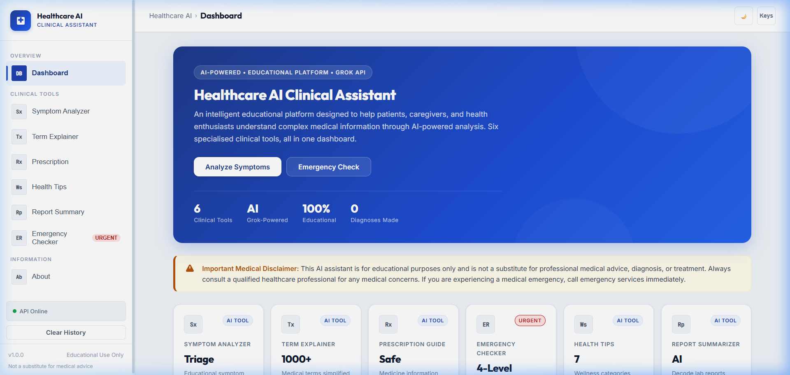
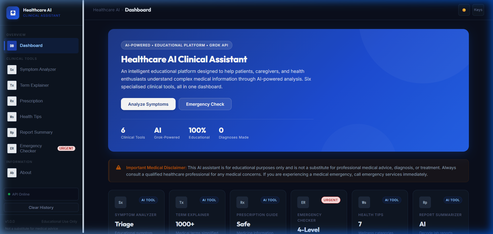
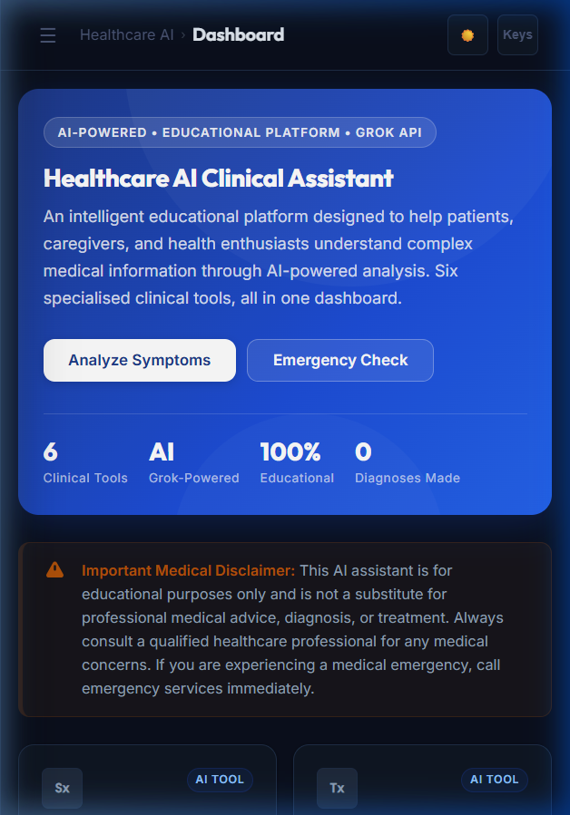
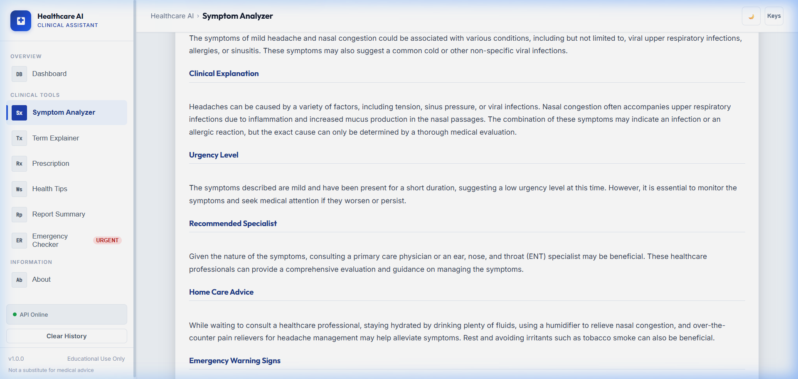
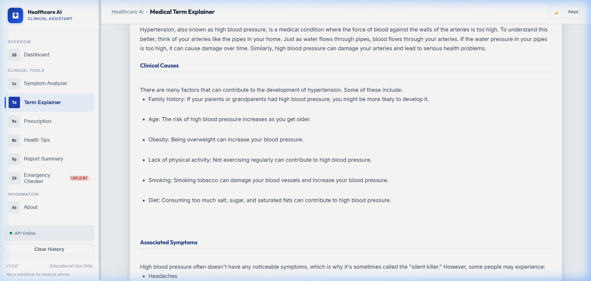
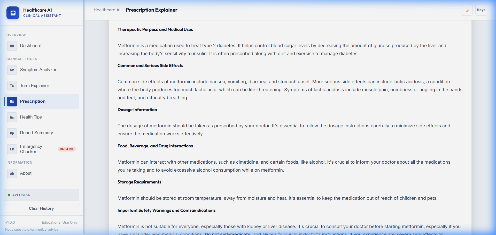
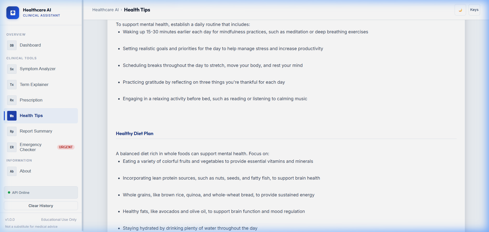
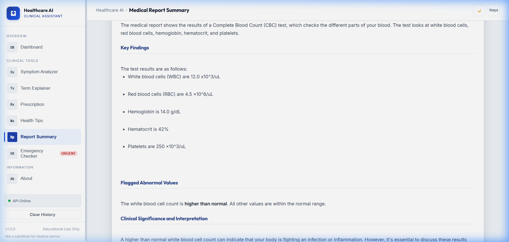
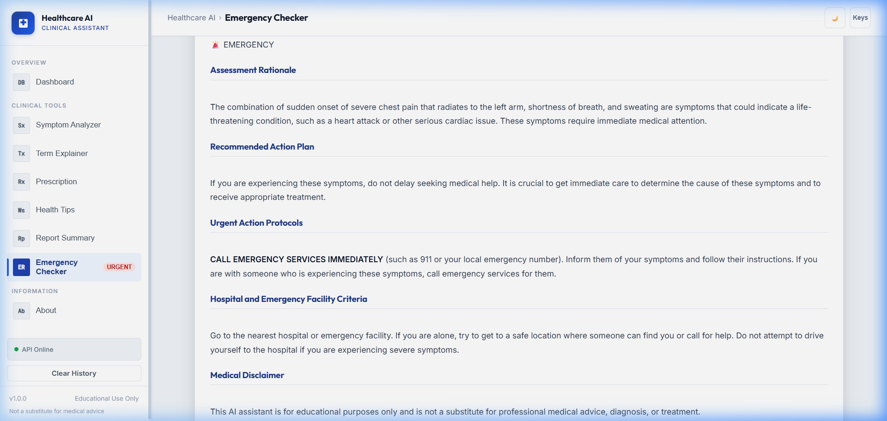

# 🏥 Healthcare AI Clinical Assistant

> An AI-powered educational healthcare assistant that helps users understand medical symptoms, medications, medical reports, and healthy lifestyle recommendations — powered by the **Grok API** (xAI).

---

## 📋 Table of Contents

- [Project Overview](#-project-overview)
- [Objectives](#-objectives)
- [Features](#-features)
- [Screenshots](#-screenshots)
- [Folder Structure](#-folder-structure)
- [Technologies Used](#-technologies-used)
- [Installation](#-installation)
- [Environment Variables](#-environment-variables)
- [Running the Application](#-running-the-application)
- [API Documentation](#-api-documentation)
- [Keyboard Shortcuts](#-keyboard-shortcuts)
- [Security](#-security)
- [Future Scope](#-future-scope)
- [License](#-license)

---

## 🏥 Project Overview

The **Healthcare AI Clinical Assistant** is a production-ready, full-stack web application that leverages the power of the Grok AI API to provide educational healthcare information to patients, caregivers, students, and health enthusiasts.

> ⚕️ **Disclaimer:** This application is **for educational purposes only** and is **not a substitute for professional medical advice, diagnosis, or treatment.** Always consult a qualified healthcare professional.

---

## 🎯 Objectives

1. Make complex medical information accessible in plain, understandable language
2. Help patients prepare better questions for their doctor visits
3. Provide evidence-based wellness and lifestyle guidance
4. Offer emergency risk triage guidance (educational, not diagnostic)
5. Explain medical prescriptions and terminology clearly
6. Never diagnose any medical condition

---

## ✨ Features

| Feature | Description |
|---|---|
| 🔍 **Symptom Analyzer** | Input age, gender, history, symptoms → Get possible conditions (educational), urgency level, specialist recommendation, home care advice, and emergency signs |
| 📖 **Medical Term Explainer** | Enter any medical term → Get meaning, causes, symptoms, diagnosis, treatment, prevention in plain language |
| 💊 **Prescription Explainer** | Enter medicine names → Get purpose, side effects, dosage info, food restrictions, storage, and warnings |
| 🌿 **Health Tips Generator** | Select a category (7 available) → Get daily routine, diet plan, exercise guide, hydration tips, and lifestyle advice |
| 📄 **Medical Report Summarizer** | Paste a report → Get simplified summary, flagged abnormal values, and questions to ask your doctor |
| 🚨 **Emergency Checker** | Describe symptoms → Get risk level (Low/Medium/High/Emergency), reasoning, and next steps |

### Bonus Features
- 🎤 Voice Input (Browser Speech Recognition API)
- 🔊 Text-to-Speech for all AI responses
- 📥 Download AI responses as PDF
- 📋 Copy response to clipboard
- 📊 Word count, character count, reading time
- 🌙 Dark / Light theme toggle
- ⌨️ Full keyboard shortcut support
- 🟢 Live API status indicator
- 🗑️ Conversation history management
- 📱 Fully responsive design (mobile-first)

---

## 📸 Screenshots

### 🖥️ Main Dashboard


### 🌙 Dark Mode Dashboard


### 📱 Mobile View (Responsive Layout)


### 🔍 Symptom Analyzer


### 📖 Medical Term Explainer


### 💊 Prescription Explainer


### 🌿 Health Tips Generator


### 📄 Medical Report Summarizer


### 🚨 Emergency Checker


---

## 📁 Folder Structure

```
Healthcare-AI/
├── backend/
│   ├── __init__.py
│   ├── main.py                    # FastAPI app, CORS, route registration
│   ├── routes/
│   │   ├── __init__.py
│   │   ├── symptom.py             # POST /api/symptom
│   │   ├── medical_term.py        # POST /api/medical-term
│   │   ├── prescription.py        # POST /api/prescription
│   │   ├── health_tips.py         # POST /api/health-tips
│   │   ├── report_summary.py      # POST /api/report-summary
│   │   └── emergency.py           # POST /api/emergency
│   ├── models/
│   │   ├── __init__.py
│   │   ├── symptom.py
│   │   ├── medical_term.py
│   │   ├── prescription.py
│   │   ├── health_tips.py
│   │   ├── report_summary.py
│   │   └── emergency.py
│   ├── services/
│   │   ├── __init__.py
│   │   └── grok_service.py        # Reusable Grok API caller
│   └── utils/
│       ├── __init__.py
│       └── validators.py          # Input sanitization helpers
├── frontend/
│   ├── index.html                 # Single-page application
│   ├── css/
│   │   └── style.css              # Complete design system
│   └── js/
│       └── app.js                 # SPA router, API client, all UI logic
├── screenshots/                   # Add your screenshots here
├── demo/                          # Add demo videos here
├── requirements.txt
├── .env.example
├── .gitignore
├── README.md
└── reflection.md
```

---

## 🛠️ Technologies Used

### Backend
| Technology | Version | Purpose |
|---|---|---|
| Python | 3.11 | Core language |
| FastAPI | 0.111.0 | REST API framework |
| Uvicorn | 0.29.0 | ASGI server |
| Pydantic | 2.7.1 | Data validation |
| httpx | 0.27.0 | Async HTTP client |
| python-dotenv | 1.0.1 | Environment variables |

### Frontend
| Technology | Purpose |
|---|---|
| HTML5 | Structure and semantics |
| CSS3 | Hospital-themed glassmorphism design |
| Vanilla JavaScript | SPA routing, API calls, all UI logic |
| Google Fonts (Inter, Outfit) | Modern typography |

### AI
| Service | Model |
|---|---|
| Grok API (xAI) | grok-3-mini |

---

## 🚀 Installation

### Prerequisites
- Python 3.11 or higher
- A Grok API key from [console.x.ai](https://console.x.ai/)

### Steps

**1. Clone or download the project:**
```bash
cd Healthcare-AI
```

**2. Create and activate a virtual environment (recommended):**
```bash
# Windows
python -m venv venv
venv\Scripts\activate

# macOS/Linux
python3 -m venv venv
source venv/bin/activate
```

**3. Install dependencies:**
```bash
pip install -r requirements.txt
```

**4. Set up environment variables:**
```bash
# Copy the example file
copy .env.example .env      # Windows
cp .env.example .env         # macOS/Linux

# Edit .env and add your API key
GROK_API_KEY=your_actual_api_key_here
```

---

## 🔑 Environment Variables

| Variable | Required | Description |
|---|---|---|
| `GROK_API_KEY` | ✅ Yes | Your Grok API key from console.x.ai |

---

## ▶️ Running the Application

### Start the Backend
```bash
python -m uvicorn backend.main:app --reload
```

> **Alternative** (if uvicorn is in PATH):
> ```bash
> uvicorn backend.main:app --reload
> ```

The API will be available at: `http://127.0.0.1:8000`

### Start the Frontend
Open `frontend/index.html` directly in your browser.

> **Tip:** For the best experience, use a local server extension like VS Code's "Live Server" or simply open the HTML file directly — CORS is configured to allow `file://` origins.

---

## 📡 API Documentation

Once the backend is running, visit:
- **Swagger UI:** [http://127.0.0.1:8000/docs](http://127.0.0.1:8000/docs)
- **ReDoc:** [http://127.0.0.1:8000/redoc](http://127.0.0.1:8000/redoc)

### API Endpoints

| Method | Endpoint | Description |
|---|---|---|
| `GET` | `/api/health` | Health check + API key status |
| `POST` | `/api/symptom` | Symptom analysis |
| `POST` | `/api/medical-term` | Medical term explanation |
| `POST` | `/api/prescription` | Prescription / medicine information |
| `POST` | `/api/health-tips` | Category-specific health tips |
| `POST` | `/api/report-summary` | Medical report summarizer |
| `POST` | `/api/emergency` | Emergency risk assessment |

### Example Request

```bash
curl -X POST "http://127.0.0.1:8000/api/medical-term" \
  -H "Content-Type: application/json" \
  -d '{"term": "Hypertension"}'
```

### Example Response
```json
{
  "result": "## 📖 Meaning\nHypertension is...",
  "status": "success"
}
```

---

## ⌨️ Keyboard Shortcuts

| Shortcut | Action |
|---|---|
| `?` | Show/hide keyboard shortcuts panel |
| `Esc` | Close modals, stop speech |
| `Ctrl + D` | Toggle dark/light mode |
| `Ctrl + 1` | Dashboard |
| `Ctrl + 2` | Symptom Analyzer |
| `Ctrl + 3` | Medical Term Explainer |
| `Ctrl + 4` | Prescription Explainer |
| `Ctrl + 5` | Health Tips |
| `Ctrl + 6` | Report Summary |
| `Ctrl + 7` | Emergency Checker |
| `Ctrl + 8` | About |

---

## 🔒 Security

- ✅ API key stored in `.env` — never exposed to the frontend
- ✅ All user inputs sanitized server-side via Pydantic validators
- ✅ HTML tags stripped from user input to prevent XSS
- ✅ CORS configured (allow all for local dev — restrict in production)
- ✅ Rate limit and timeout handling
- ✅ `.env` excluded from version control via `.gitignore`

---

## 🔭 Future Scope

- [ ] User authentication and personal health profiles
- [ ] Multi-language support (Hindi, Spanish, French, etc.)
- [ ] Integration with real medical databases (MedlinePlus, OpenFDA)
- [ ] Appointment booking with nearby doctors
- [ ] Wearable device integration (heart rate, SpO2 data)
- [ ] Progressive Web App (PWA) with offline support
- [ ] Medication reminder system
- [ ] Family health dashboard
- [ ] Exportable health diary / journal
- [ ] Telemedicine video call integration

---

## 📄 License

This project is licensed under the **MIT License**.

---

## ⚕️ Final Disclaimer

> **This AI assistant is for educational purposes only and is not a substitute for professional medical advice, diagnosis, or treatment.** Always seek the advice of your physician or other qualified health provider with any questions you may have regarding a medical condition. If you are experiencing a medical emergency, call 911 or your local emergency services immediately.
