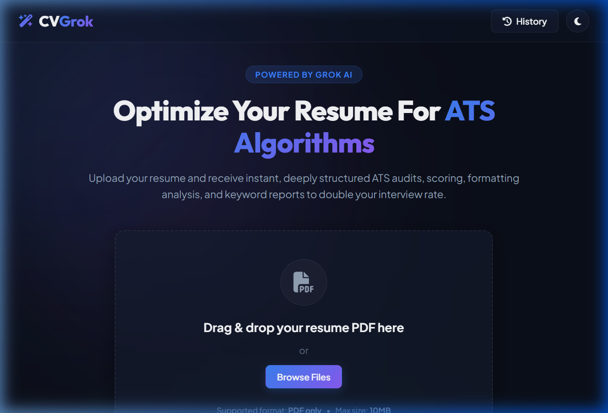
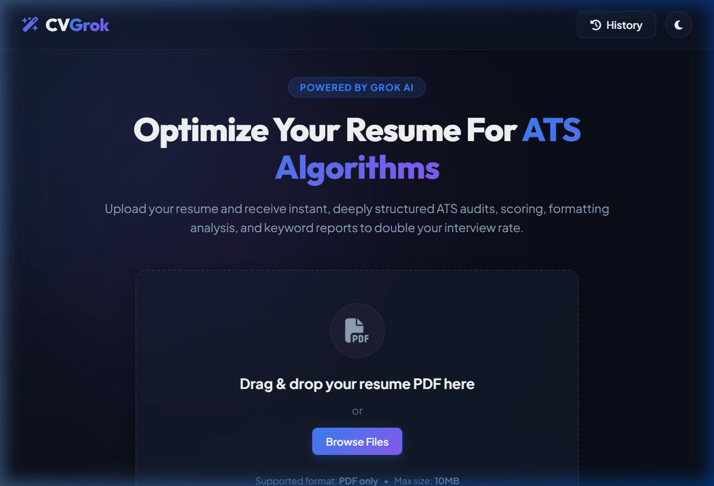
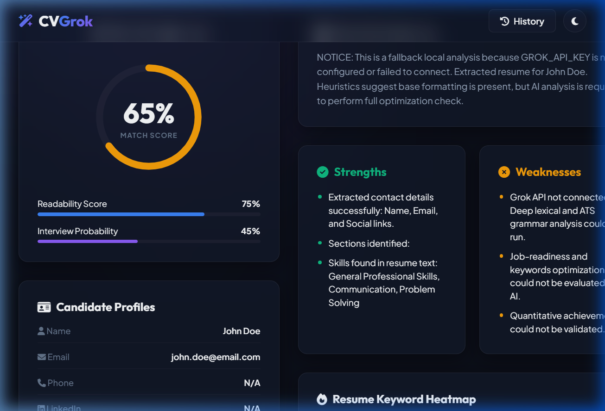
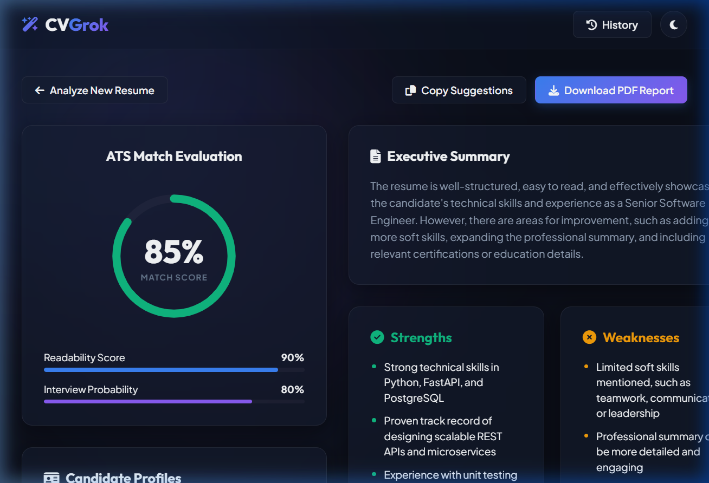
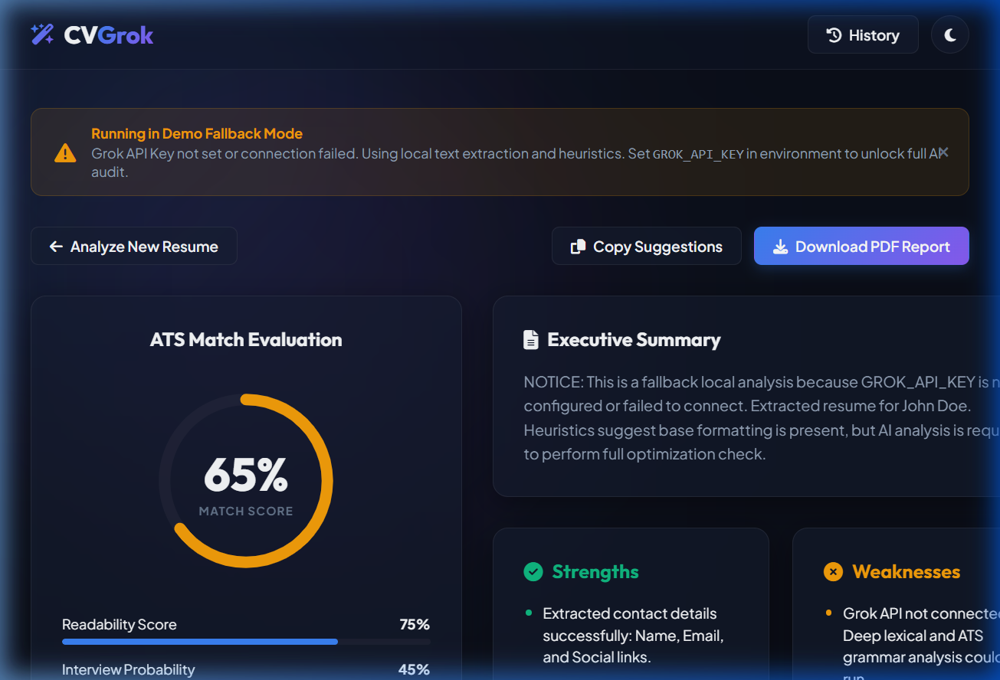
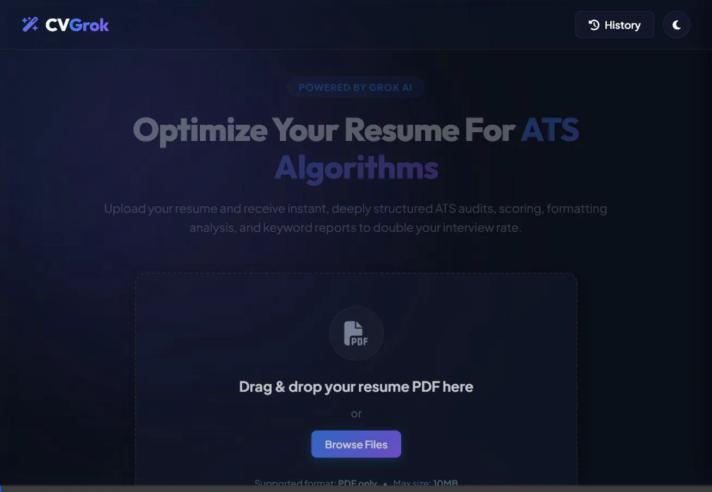
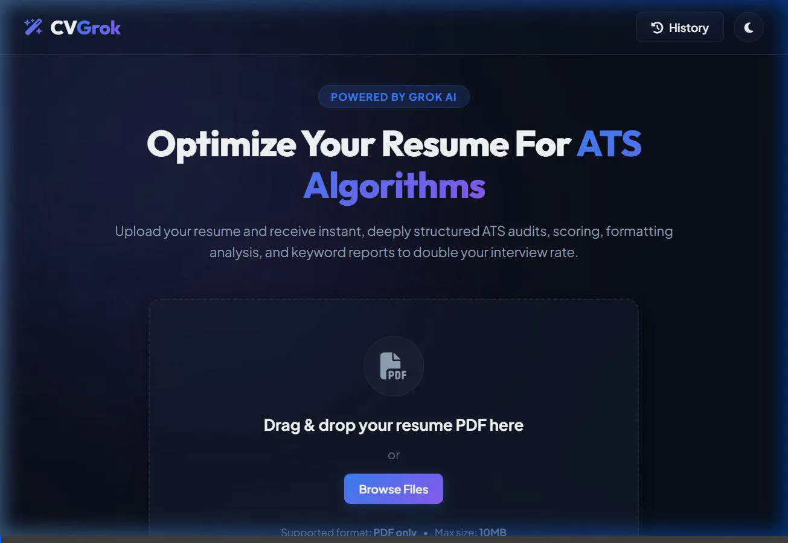

# CVGrok: AI Resume Analyzer & ATS Audit Dashboard

CVGrok is a professional-grade, production-ready AI Resume Analyzer designed to parse resume PDF documents, extract metadata structures, and execute a comprehensive Applicant Tracking System (ATS) optimization audit. Powered by **xAI Grok / Groq Cloud API**, the system performs semantic analysis, flags grammatical bugs, details keyword deficiencies, and generates an executive PDF report.

---

## Workspace Structure

This workspace is organized with a flat, modular structure directly at the root:

```
workspace/
│
├── screenshots/             # Verification media folder
│   ├── landing_page_1785060428541.png     # Landing screen capture (v1)
│   ├── landing_page_1785061242311.png     # Landing screen capture (v2)
│   ├── dashboard_view_1785060483900.png   # Analysis dashboard capture (v1)
│   ├── dashboard_view_1785061355639.png   # Analysis dashboard capture (v2)
│   ├── final_dashboard_1785060591838.png  # Final complete dashboard view
│   ├── e2e_resume_analyzer_test_1785060397652.webp # E2E live flow demo video (v1)
│   └── live_groq_api_test_1785061226804.webp # E2E live flow demo video (v2)
│
├── frontend/                # Frontend web views (HTML/CSS/JS)
│   ├── index.html           # Glassmorphic single page dashboard
│   ├── style.css            # Stylesheet containing design tokens
│   └── script.js            # AJAX calls, LocalHistory and Chart.js bindings
│
├── uploads/                 # Directory holding temporary uploaded PDFs
│
├── app.py                   # FastAPI application initialization & routes
├── prompts.py               # ATS evaluation prompts and async API router
├── utils.py                 # PyMuPDF text extractor and ReportLab PDF generator
├── test_env.py              # validation test for environment keys
├── requirements.txt         # Python system dependencies
├── Reflection_Report.md     # Engineering choices, trade-offs and profiling
├── .env.example             # Template env config
└── .gitignore               # Excludes caches and local credentials
```

---

## 🛠️ Tech Stack & Key Modules

1. **[app.py](file:///d:/Day%207/app.py)**: Serves backend API routes (`/api/upload`, `/api/analyze`, `/api/report`, `/api/cleanup`) and hosts the frontend SPA directly on the root `/` path.
2. **[prompts.py](file:///d:/Day%207/prompts.py)**: Formulates ATS audit criteria prompts. Includes an auto-router checking API key prefixes: if starting with `gsk_`, it targets the Groq Cloud endpoint (`llama-3.3-70b-versatile`); otherwise, it targets the xAI Grok API (`grok-2-1212`).
3. **[utils.py](file:///d:/Day%207/utils.py)**: Coordinates text extraction via a sequential `PyMuPDF` + `pdfplumber` fallback, filters contact details via heuristics, and compiles visually stunning, printable PDF reports via `reportlab` layout flowables.
4. **[test_env.py](file:///d:/Day%207/test_env.py)**: Provides developers with a quick script to test environment configurations and run a diagnostic query verifying token authorization.
5. **[Reflection_Report.md](file:///d:/Day%207/Reflection_Report.md)**: A retrospective report summarizing architecture decisions (FastAPI unified hosting vs decoupled, ReportLab vs Weasyprint dependencies) and profiling metrics.

---

## 🚀 Installation & Local Execution

### 1. Configure Credentials
Copy the environment template and edit your keys:
```bash
cp .env.example .env
```
Inside your new `.env` file, populate your key:
```env
GROK_API_KEY=gsk_your_actual_key_here
```

### 2. Verify Key and Environment Connectivity
Run the test script to verify your key works and connects to the correct provider:
```bash
# Install requirements
pip install -r requirements.txt

# Run connection diagnostic
python test_env.py
```

### 3. Run Server
Launch the unified server:
```bash
python app.py
```
Open **`http://localhost:8000`** in your browser to start uploading resumes!

---

## 📸 Media Demonstrations

The verification media assets are stored inside the `screenshots/` directory:

### 🌐 Landing Page Design

Here are the designs of the CVGrok landing page, showcasing the clean glassmorphic aesthetic:

- **Landing Page (Version 1):**
  

- **Landing Page (Version 2):**
  

---

### 📊 Completed Analysis Dashboard

Visual representations of the dashboard interface once a resume has been successfully parsed and evaluated:

- **Dashboard View (Version 1):**
  

- **Dashboard View (Version 2):**
  

- **Final Complete Dashboard:**
  

---

### 🎥 End-to-End Live User Flow Demonstrations

These high-framerate WebP screen recordings/animations demonstrate the full interactive flow of the application in real-time, including uploading a PDF, seeing the step-by-step parsing progress, exploring the dashboard widgets, filtering keywords, and downloading the compiled report:

- **Live Flow Demonstration (Groq API):**
  

- **End-to-End Resume Analyzer Demonstration:**
  

