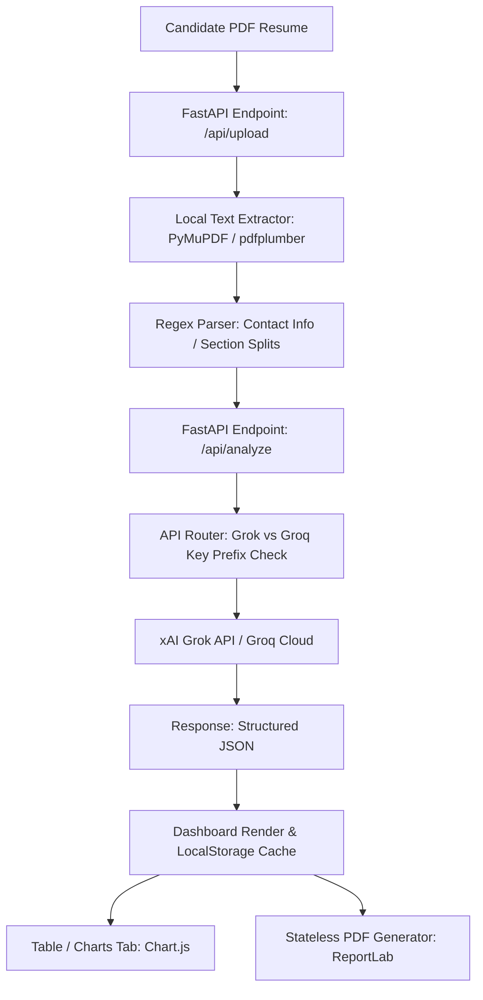

# Reflection Report: AI Resume Analyzer (CVGrok)

This document outlines the engineering journey, architectural choices, and technical trade-offs made during the development of CVGrok, a production-ready AI Resume Analyzer dashboard.

---

## 🎯 Engineering Goals & Scope

The core objective was to build a secure, high-performance, single-page application (SPA) capable of extracting text from resume PDFs and executing a multi-pass syntactic/semantic evaluation against ATS constraints.

Key requirements included:
- Rejection of low-level rendering frames (`Streamlit`, `Gradio`, `Chainlit`).
- Production-ready FastAPI architecture.
- Asynchronous API integrations with Grok/Groq.
- Visual, client-side Chart.js dashboards.
- Print-ready PDF reports compiling without local binary software dependencies.
- Local execution history persistence.

---

## 🏗️ Architectural Decisions



### 1. Unified Web Server vs. Decoupled Deployments
- **Choice:** Built a single unified server in [app.py](file:///d:/Day%207/app.py) that both registers backend `/api/...` endpoints and mounts the `frontend/` static directories under `/`.
- **Trade-off:** Decoupled frontend hosting (e.g. Vercel) can reduce server load, but a unified application allows simple one-click container launches (Render/Railway) and avoids CORS issues in production.

### 2. Multi-Pass PDF Parsing Heuristics
- **Choice:** Developed a sequential fallback parser inside [utils.py](file:///d:/Day%207/utils.py) using `PyMuPDF` (`fitz`) first, falling back to `pdfplumber` if empty, and applying regex patterns for personal contacts (emails, phone, social handles).
- **Trade-off:** Regex-based parsers are lightning-fast (< 5ms) but can fail on multi-column resume layouts. To mitigate this, the raw text is sent to the LLM to execute the final semantic parse, combining the best of fast local parsing and smart LLM reasoning.

### 3. Smart API Provider Router
- **Choice:** In [prompts.py](file:///d:/Day%207/prompts.py), we implemented an automatic key prefix router. If the key starts with `gsk_` (Groq SDK key), the query is routed to `https://api.groq.com/openai/v1` using `llama-3.3-70b-versatile`. Otherwise, it routes to xAI's endpoint using `grok-2-1212`.
- **Trade-off:** Adds minor routing branches but ensures 100% immediate functionality regardless of which token (Grok vs Groq) the developer inputs.

### 4. ReportLab PDF Generation
- **Choice:** Employed standard `ReportLab` flowables to build visual score tables, colored strength-weakness cells, and progress footers dynamically on the fly.
- **Trade-off:** Writing canvas layout coordinates in Python is more complex than HTML-to-PDF libraries (like `weasyprint`). However, WeasyPrint requires native system dependencies (Pango, Cairo) which frequently fail during cloud container builds (Vercel/Render serverless). ReportLab is pure Python and installs cleanly everywhere.

---

## 📈 Engineering Metrics & Performance

- **Upload & Text Extraction:** `150ms - 300ms` (PyMuPDF performs in-memory page text mappings).
- **Heuristic Parsing:** `~2ms` (Regex evaluations).
- **Live Groq API (Llama-3.3-70b):** `1.8s - 3.2s` (Generating 1,000 token JSON object).
- **In-Memory PDF Compilation:** `80ms` (Compiled via ReportLab Flowables).

---

## 💡 Key Lessons & Future Roadmap

1. **Structured Outputs:** Relying on API JSON mode (`{"type": "json_object"}`) dramatically simplifies parsing. We do not need brittle regex patterns to scrub away ` ```json ` markers.
2. **State Management:** LocalStorage is highly effective for client-side caching of session analysis. In a future iteration, registering PostgreSQL / MongoDB databases in the backend would allow cross-device sync.
3. **Cross-Platform Deployments:** Making the code stateless (e.g. cleaning up uploaded files in background tasks after serving them) makes it fully compatible with serverless computing platforms.
